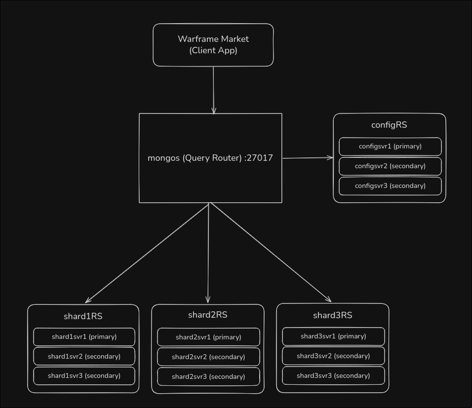

# warframe-market-mongo-distributed

A full-stack simulation of the Warframe Market domain running on a distributed MongoDB cluster featuring a sharded architecture with Replica Sets, Docker Compose, a Hono API backend, and a React frontend.

## Topology



The cluster consists of 13 Docker containers: 3 Config Servers (configRS), 3 shards with 3 replicas each, 1 mongos router, and 1 init job.

## Stack

- **Database:** MongoDB 7 (sharded cluster with 3 config servers + 3 shards × 3 replicas + mongos)
- **Backend:** Bun + Hono + MongoDB driver
- **Frontend:** Vite + React + Tailwind CSS v4
- **Validation:** Zod (shared between frontend and backend)

## Project Structure

```
├── apps/
│   ├── api/          # Hono REST API (port 3000)
│   └── web/          # React SPA (port 5173)
├── packages/
│   ├── shared/       # Zod schemas + TS types
│   └── seed/         # Warframe Market API ingestion script
├── docker-compose.yml
├── scripts/
│   └── init-cluster.sh
```

## Getting Started

1. Start the MongoDB cluster:

```bash
docker compose up -d
```

Wait ~30 seconds for the cluster to initialize.

2. Start the API and frontend:

```bash
bun run dev
```

3. Seed data from the Warframe Market API:

```bash
bun run seed
```

4. Open http://localhost:5173

## API Endpoints

| Method | Path                      | Auth | Description                  |
| ------ | ------------------------- | ---- | ---------------------------- |
| POST   | `/api/auth/register`      | No   | Create account               |
| POST   | `/api/auth/login`         | No   | Login (sets HttpOnly cookie) |
| POST   | `/api/auth/logout`        | No   | Clear session                |
| GET    | `/api/auth/me`            | Yes  | Current user                 |
| GET    | `/api/items`              | No   | List/search items            |
| GET    | `/api/items/:id`          | No   | Item details                 |
| GET    | `/api/orders`             | No   | List orders (filterable)     |
| POST   | `/api/orders`             | Yes  | Place order                  |
| PUT    | `/api/orders/:id`         | Yes  | Update own order             |
| DELETE | `/api/orders/:id`         | Yes  | Cancel own order             |
| GET    | `/api/transactions`       | No   | List transactions            |
| POST   | `/api/transactions`       | Yes  | Complete an order            |
| GET    | `/api/ratings`            | No   | List ratings                 |
| POST   | `/api/ratings`            | Yes  | Rate a player                |
| GET    | `/api/players/:id`        | No   | Profile + reputation         |
| GET    | `/api/players/:id/orders` | No   | Player's orders              |

## Design Patterns

### Computed Pattern

Player reputation is **not stored** as a persistent field. Instead, it is computed by aggregating the associated `positive` and `neutral` ratings from the `ratings` collection.

### Two Collection Pattern

`orders` and `transactions` are modeled as separate collections because they have different lifecycles and query patterns.

## Collections and Shard Keys

See the detailed breakdown of shard keys and rationale in the [cluster init script](scripts/init-cluster.sh).

| Collection     | Shard Key                         | Rationale                             |
| -------------- | --------------------------------- | ------------------------------------- |
| `items`        | `{ _id: "hashed" }`               | Max cardinality, uniform distribution |
| `players`      | `{ _id: "hashed" }`               | Max cardinality, no range queries     |
| `orders`       | `{ platform: 1, item_id: 1 }`     | Compound key for targeted queries     |
| `transactions` | `{ item_id: 1, completed_at: 1 }` | Avoids ascending-key hotspot          |
| `ratings`      | Not sharded                       | Low write volume                      |
